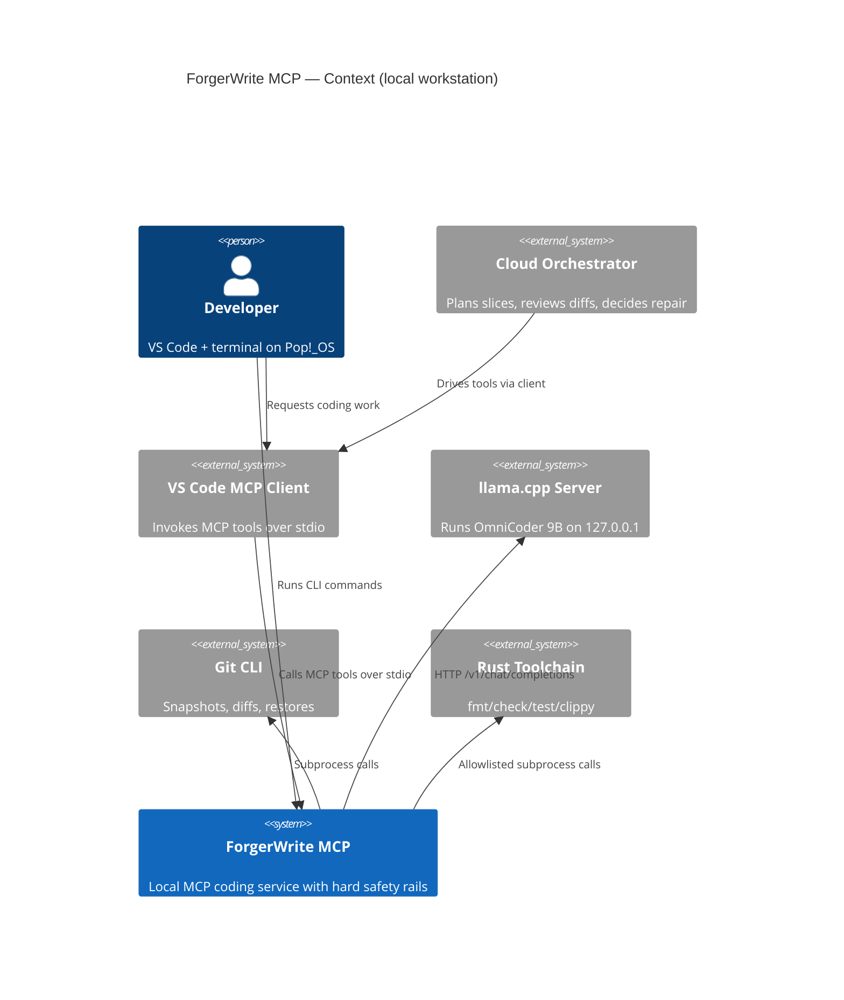
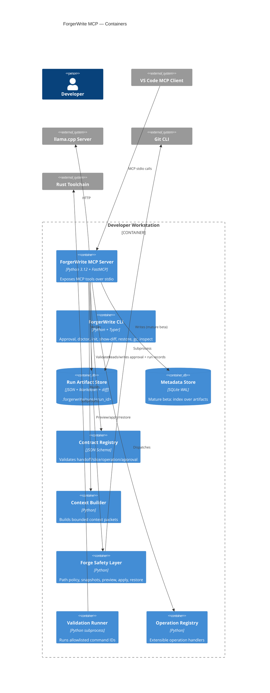
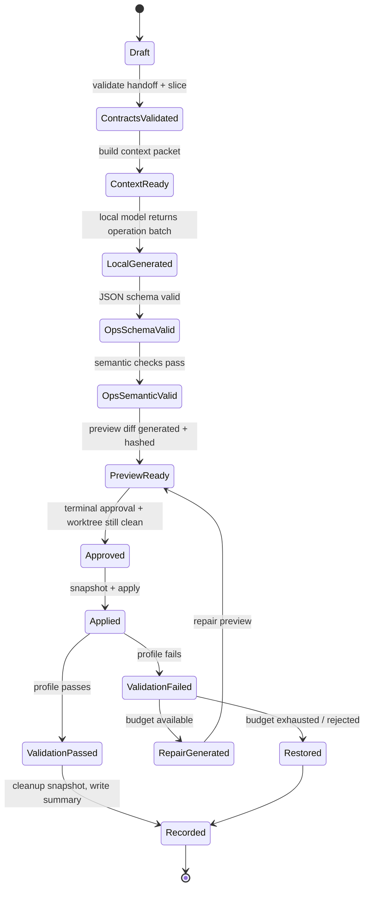
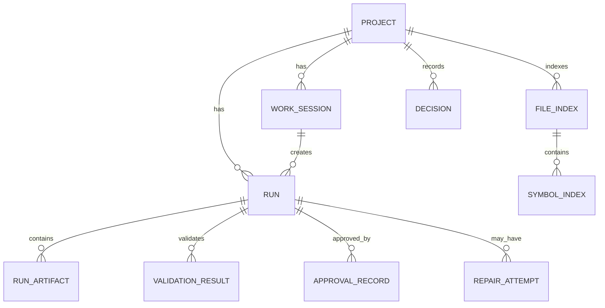

# ForgerWrite MCP — Revised Design Document

---

## 0. Document Status

| Field             | Value                                                    |
| ----------------- | -------------------------------------------------------- |
| Title             | ForgerWrite MCP — Revised Design Document                |
| Revision          | 2.0                                                      |
| Date              | 2026-06-06                                               |
| Status            | Pre-implementation (Phase 0 spike required before code)  |
| Replaces          | Design Document v1.0                                     |
| Scope             | MVP through Mature Beta for local-first single-user tool |
| Explicitly out    | Kubernetes, Redis, multi-region, remote SaaS, Terraform  |
| Reviewer feedback | Incorporated (TDD, DRY, SRP, OCP, data-driven, encapsulation) |

### 0.1 Revision summary

Revision 1.0 was reviewed by a senior engineer. The following categories of problems were identified and resolved in this revision:

| Category                       | Resolution                                                                                       |
| ------------------------------ | ------------------------------------------------------------------------------------------------ |
| Enterprise template creep      | Removed Kubernetes, Terraform-AWS, Redis, multi-region; moved to Appendix B as deferred research |
| Unresolved blocking dependency | Promoted llama.cpp+OmniCoder JSON-schema spike to Phase 0 gate                                   |
| MCP stdout corruption risk     | Added mandatory stdout-to-stderr redirect at server boot                                         |
| Known-broken code in design    | Removed incorrect `insert_after_line` via `replace_line_range`; one correct version remains      |
| TOCTOU in approval flow        | Re-check worktree cleanliness in `assert_approved` and in `fw_apply_approved_operations`         |
| TDD violation                  | Restructured phases: failing tests precede implementation in every step                          |
| DRY violation (path safety)    | Consolidated to single `safe_resolve_path` in shared `paths` module                              |
| SRP violation (god workflow)   | Split into `SliceCoordinator`, `GenerationStrategy`, `ApplyCoordinator`                          |
| Open/Closed violation          | Introduced `OperationHandler` registry                                                           |
| Magic numbers                  | Moved every limit/timeout/parameter into `forgerwrite.toml`                                      |
| Encapsulation violation        | MCP errors map to public codes; no exception class names or raw messages leak                    |
| Missing quick wins             | Added `doctor`, `show-diff`, `init`, `--dry-run`, colorized output                               |

---

## 1. Executive Summary

### 1.1 Problem

Local coding models (small, fast, private) are increasingly capable of narrow, well-scoped code edits, but cannot be trusted as autonomous repo agents. Cloud models are excellent at planning, review, and judgment, but expensive per token. There is no production-grade local tool that cleanly delegates narrow slices to a bounded local writer while preserving the cloud model's orchestration role — and fails closed when the local model misbehaves.

### 1.2 Solution

**ForgerWrite MCP** is a local-first MCP coding service that:

1. Receives narrow slices from a cloud orchestrator via MCP.
2. Builds a bounded context packet from allowed files only.
3. Calls a local writer (OmniCoder 9B via llama.cpp) to produce a structured JSON operation batch.
4. Validates the batch at two layers: schema and semantic.
5. Produces a preview diff against a clean git worktree, hashed and persisted.
6. Requires terminal approval via the `forgerwrite` CLI before applying anything.
7. Applies operations atomically against a git snapshot, then runs a Rust validation profile.
8. On failure, offers a bounded repair loop with an explicit budget.
9. Writes every run as inspectable JSON + Markdown artifacts.

### 1.3 Business value

- **Cost**: repetitive code generation moves off the cloud meter.
- **Privacy**: run logs, source snippets, and validation output never leave the workstation.
- **Trust**: preview-before-apply, hash-bound approvals, git snapshots, and bounded repair make the local writer safe to use inside real repositories.
- **Inspectability**: every run is a directory of JSON artifacts and a Markdown summary — debuggable at 2 AM.
- **Extensibility**: Rust first, with a language-adapter seam for Python, Go, and C/C++ in mature beta.

### 1.4 Scope

**In scope — MVP:**

- Local MCP server (Python 3.12, stdio, FastMCP).
- Separate `forgerwrite` CLI (approval, doctor, init, show-diff, restore, gc, inspect).
- llama.cpp HTTP client with JSON-schema retries.
- Structured JSON operation batches.
- Forge safety layer (scope check, snapshot, preview, apply, restore).
- Rust validation profile (`fmt`, `check`, `test`, `clippy`).
- Bounded repair loop.
- JSON artifacts + Markdown summaries.

**In scope — Mature Beta (same product, same machine):**

- SQLite metadata index over JSON artifacts.
- Optional local HTTP control API bound to `127.0.0.1` with JWT.
- llama.cpp lifecycle supervision.
- Language adapters (Python, Go, C/C++).
- Unified diff fallback for hard edits.
- OS keyring for secrets.
- Optional daemon mode with health probes.

**Out of scope — explicitly:**

- Remote SaaS, multi-tenant, multi-user auth.
- Swarm / multi-agent coordination.
- Unrestricted shell or arbitrary MCP tool calling.
- General chat, roleplay, or code search UI.
- Embedding-based retrieval in MVP.
- Kubernetes, Redis, remote Terraform, multi-region failover. These are deferred to Appendix B as research notes only — not part of the product roadmap.

### 1.5 Top architectural drivers

1. **Safety** — no direct model writes; clean worktree; schema + semantic validation; preview diff hash-bound to approval; git snapshot; restored on failure.
2. **Cost and locality** — cloud orchestrates, local writes, logs stay on disk, no telemetry by default.
3. **Extensibility** — JSON schemas versioned; operation registry extensible; language adapters pluggable; SQLite added without rewriting JSON artifacts.

---

## 2. System Architecture

### 2.1 C4 Context diagram



### 2.2 C4 Container diagram



### 2.3 Component inventory

| Component              | Type            |   MVP | Mature beta add-ons                          | Responsibility                                  | Storage                              |
| ---------------------- | --------------- | ----: | -------------------------------------------- | ----------------------------------------------- | ------------------------------------ |
| VS Code MCP client     | Frontend        |   Yes | Generic MCP clients                          | Invoke tools over stdio                         | None                                 |
| MCP server             | Local service   |   Yes | Optional daemon mode                         | Expose tools, orchestrate local workflow        | Run artifacts                        |
| CLI                    | Local CLI       |   Yes | Optional HTTP wrapper                        | Approval, doctor, init, restore, inspect, gc    | Approval records                     |
| Contract Registry      | Module          |   Yes | —                                            | Load and validate JSON schemas                  | Schema files (bundled)               |
| Context Builder        | Module          |   Yes | Language-adapter hooks                       | Build bounded local model context               | Context packet JSON                  |
| Local Model Client     | Module          |   Yes | Backend abstraction (Ollama etc.)            | Call llama.cpp, retry invalid JSON              | Raw output + parsed output           |
| Operation Registry     | Module          |   Yes | New operation handlers pluggable            | Dispatch `op` names to handlers                 | None                                 |
| Semantic Validator     | Module          |   Yes | Language-specific checks                     | Scope, size, and forbidden-target checks        | None                                 |
| Forge Safety Layer     | Module          |   Yes | —                                            | Path checks, snapshot, preview, apply, restore  | Git refs                             |
| Validation Runner      | Module          |   Yes | Language-adapter profiles                    | Run allowlisted command IDs                     | Validation result JSON               |
| Repair Coordinator     | Module          |   Yes | —                                            | Bounded repair loop with explicit budget        | Repair artifacts                     |
| Artifact Store         | File store      |   Yes | —                                            | Persist run inputs and outputs                  | `.forgerwrite/runs`                  |
| Metadata Store         | SQLite          |    No | Yes                                          | Queryable index over artifacts                  | `.forgerwrite/forgerwrite.db`        |
| HTTP Control API       | Optional BFF    |    No | Yes (local-only)                             | UI/automation wrapper                           | SQLite + artifacts                   |
| Message broker         | —               |    No | No                                           | Not required — local synchronous workflow       | —                                    |
| Cache layer            | —               |    No | In-process LRU only                          | No Redis: local tool, single user               | In-memory                            |
| CDN                    | —               |    No | No                                           | Not applicable                                  | —                                    |

### 2.4 Technology stack

| Layer              | Technology       | Version                         | Rationale                                          |
| ------------------ | ---------------- | ------------------------------: | -------------------------------------------------- |
| Language           | Python           | 3.12.x                          | User preference; mature typing; fast prototype     |
| Package manager    | uv               | 0.5.x+                          | Fast env/dependency management                     |
| MCP SDK            | `mcp[cli]`       | latest stable at impl time      | Official Python FastMCP path                       |
| Data models        | Pydantic         | 2.x                             | Strong typed validation                            |
| JSON Schema        | `jsonschema`     | 4.x (Draft 2020-12)             | Contract validation                                |
| HTTP client        | httpx            | 0.27.x+                         | Async llama.cpp calls                              |
| CLI                | Typer            | 0.12.x+                         | Typed CLI with good UX                             |
| Terminal output    | Rich             | 13.x+                           | Colorized, structured terminal output              |
| Test framework     | pytest           | 8.x                             | Python standard                                    |
| Lint/format        | Ruff             | 0.6.x+                          | Fast and opinionated                               |
| Type check         | mypy             | 1.x                             | Review-grade typing                                |
| Local model server | llama.cpp server | build w/ OpenAI-compat + schema | Best local control                                 |
| First model        | OmniCoder 9B     | Q8 or better quant (Phase 0)    | Mature local code candidate                        |
| Target language    | Rust             | stable toolchain                | User's main language; well-defined validation      |
| Metadata DB        | SQLite           | 3.45+ (mature beta)             | Local, inspectable, WAL                            |
| Container (opt.)   | Docker           | 25.x+ (mature beta daemon only) | Optional packaging for daemon                      |

### 2.5 Network boundaries

| Boundary                    | Protocol       | Direction     | Security posture                                  |
| --------------------------- | -------------- | ------------- | ------------------------------------------------- |
| VS Code → MCP server        | stdio JSON-RPC | local process | Local user trust + MCP confirmation               |
| MCP server → llama.cpp      | HTTP localhost | outbound      | Bind llama.cpp to `127.0.0.1` only                |
| CLI → run artifacts         | filesystem     | local         | OS file permissions; optional `0700` directory    |
| MCP server → Git/Cargo      | subprocess     | local         | Allowlisted command IDs only                      |
| Optional control API → CLI  | HTTP localhost | local         | JWT bound to `127.0.0.1` (mature beta)            |

### 2.6 Data storage per module

| Module               | Storage                       | Contents                                      |
| -------------------- | ----------------------------- | --------------------------------------------- |
| Contract Registry    | bundled package files         | JSON schemas (versioned)                      |
| Run Artifact Store   | `.forgerwrite/runs/<run_id>`  | all per-run artifacts                         |
| Approval Store       | run folder                    | `approval_record.json`                        |
| SQLite Store         | `.forgerwrite/forgerwrite.db` | index over runs, sessions, validations (beta) |
| Forge Safety Layer   | git refs                      | `refs/forgerwrite/<run_id>` snapshots         |
| Local Model Client   | run folder                    | raw output + parsed output                    |
| Config               | `.forgerwrite/forgerwrite.toml` | project + limits + model + validation       |

---

## 3. Architecture Decision Records

### ADR-001 Python MCP First, Rust Harness Later

**Status:** Accepted

**Context.** The long-term Forgewright concept is a safe local coding harness. The user's main language is Rust, but the goal is to prove the local-model + MCP workflow before committing to a full Rust harness.

**Decision.** Implement the MVP as a Python 3.12 MCP server with a separate CLI. Extract safety-critical mutation code to Rust in mature beta if the MVP validates the model.

**Alternatives.**

| Alternative           | Pros                                                     | Cons                                               |
| --------------------- | -------------------------------------------------------- | -------------------------------------------------- |
| Python MCP first      | Fast iteration; MCP SDK ergonomic; good prototyping fit  | Less memory/type safety for file mutation          |
| Rust MCP from day one | Strong safety/performance; language alignment            | Slower to prototype; framework friction            |
| Shell scripts         | Very fast                                                | Unreviewable, unsafe, poor extensibility           |

**Consequences.**

- Mutation code must be small and heavily tested.
- MCP interface stabilizes before a Rust rewrite.
- `Forge Safety Layer` module boundary is deliberately narrow to ease extraction.

### ADR-002 llama.cpp as First Backend

**Status:** Accepted

**Decision.** Use llama.cpp server as the first local backend. Abstract behind a `LocalModelBackend` interface in mature beta.

**Alternatives.**

| Alternative | Pros                                          | Cons                                                |
| ----------- | --------------------------------------------- | --------------------------------------------------- |
| llama.cpp   | Best control; schema/grammar path; many GGUFs | Manual setup; lifecycle complexity                  |
| Ollama      | Easy UX                                       | Less control over low-level schema settings         |
| KoboldCPP   | Familiar                                      | Less ideal as first structured coding backend       |
| LM Studio   | Friendly UI                                   | Not automation-first                                |

**Consequences.**

- MVP assumes llama.cpp is externally launched. Phase 0 spike validates JSON-schema reliability.
- Mature beta adds supervised launch + health probes.

### ADR-003 Structured JSON Operations First

**Status:** Accepted

**Decision.** Require structured JSON operation batches first. MVP operation types: `create_file`, `replace_file`, `replace_line_range`, `insert_after_line`, `insert_before_line`, `delete_file`. Unified diff fallback disabled by default; enabled per-slice in mature beta.

**Alternatives.**

| Alternative           | Pros                                                 | Cons                                          |
| --------------------- | ---------------------------------------------------- | --------------------------------------------- |
| Structured JSON ops   | Strong validation; op-level logs; scope checks       | Harder for model on complex edits             |
| Unified diff first    | Natural for code edits; applies with `git apply`     | Harder semantic validation; bigger blast area |
| Full file replacement | Simple for model                                     | Poor reviewability                            |

### ADR-004 Clean Worktree Required Before Mutation

**Status:** Accepted

**Decision.** ForgerWrite refuses preview/apply unless `git status --porcelain` is clean. Re-checked before apply to prevent TOCTOU.

**Alternatives.**

| Alternative               | Pros                         | Cons                                               |
| ------------------------- | ---------------------------- | -------------------------------------------------- |
| Require clean worktree    | Simple, safe, easy restore   | Less convenient during active development          |
| Allow dirty allowed files | More flexible                | Harder to attribute changes                        |
| Auto-stash                | Convenient                   | Surprising, hard to debug                          |

### ADR-005 JSON Logs First, SQLite as an Index Later

**Status:** Accepted

**Decision.** JSON + Markdown artifacts are the source of truth. SQLite is added in mature beta as a queryable index, never as the only record.

**Alternatives.**

| Alternative  | Pros                            | Cons                                    |
| ------------ | ------------------------------- | --------------------------------------- |
| JSON first   | Debuggable; no migration burden | Poor querying at scale                  |
| SQLite first | Queryable; structured           | Slower to iterate; migration overhead   |

**Consequences.** Every run is file-inspectable. SQLite additions cannot remove JSON files.

### ADR-006 No Remote Infrastructure in Product

**Status:** Accepted

**Decision.** The product is local-first and single-user. Kubernetes, Redis, multi-region failover, and Terraform-managed cloud resources are not part of the product. Remote infrastructure research is captured in Appendix B for a hypothetical remote benchmark lab, not for the shipped artifact.

**Rationale.** Adding remote infrastructure to a local tool inflates scope, hides real risk behind YAML, and delays user value.

---

## 4. Phase 0 Spikes (Pre-Implementation Gates)

Phase 0 is exploratory and disposable. Each spike produces a **go/no-go decision**, not reusable code.

### 4.1 Spike A — llama.cpp + OmniCoder JSON-schema reliability

**Question.** Can OmniCoder 9B produce schema-valid JSON through llama.cpp's `response_format.json_schema` with high enough reliability to drive the tool?

**Method.**

1. Build or pull llama.cpp with OpenAI-compatible chat + JSON schema.
2. Load OmniCoder 9B (Q8; fall back to other quants if OOM).
3. Author 50 representative prompts (create small test, replace line range in lib, insert import, etc.).
4. For each prompt: call the chat endpoint with a strict `operation_batch.v1` schema; validate response.
5. Record: success, parse failure, schema failure, timeout.

**Decision gates.**

| Schema-valid rate | Decision                                                               |
| ----------------- | ---------------------------------------------------------------------- |
| ≥ 80%             | Go. Proceed with MVP structured JSON first.                            |
| 60–80%            | Conditional go. Add grammar-constrained generation + increase retries. |
| < 60%             | No-go. Pivot to unified diff fallback immediately, or try larger model. |

**Artifact.** `spikes/001_json_schema/report.md` with numbers, raw responses, and a clear GO/NO-GO.

### 4.2 Spike B — MCP stdio server minimal viable

**Question.** Does FastMCP over stdio work cleanly in VS Code without protocol corruption?

**Method.**

1. Build a minimal FastMCP server with `fw_ping` and `fw_echo`.
2. Write `.vscode/mcp.json` to launch it.
3. Confirm tool calls round-trip.
4. Force a `print()` inside a tool — confirm it corrupts stdio.
5. Add stdout-to-stderr redirect — confirm corruption is prevented.

**Decision gate.** If the redirect does not prevent corruption, identify the logging sink that does and document it as a mandatory boot step.

### 4.3 Spike C — llama.cpp server lifecycle

**Question.** What is the exact launch command, cold-start time, memory footprint, and failure mode of llama.cpp with OmniCoder 9B on the target machine?

**Artifact.** A documented `llama.cpp` launch script with flags, plus baseline numbers (cold start seconds, resident MB, tokens/sec on a representative prompt).

### 4.4 Phase 0 exit criteria

All three spikes must produce written reports. Spike A must be GO or CONDITIONAL GO. Decisions are recorded as ADR-007 before Phase 1 starts.

---

## 5. Detailed Component Design

Each section below follows TDD order: **tests first, then implementation, then notes on what's deliberately deferred.**

### 5.1 Configuration Module

#### Responsibility

- Locate `.forgerwrite/forgerwrite.toml`.
- Load project, model, validation, permission, hygiene, and limits sections.
- Provide typed config with no magic numbers leaking into modules.
- Fail closed on malformed config.

#### Interface

```python
def load_config(project_root: Path) -> ForgerWriteConfig: ...
```

#### Tests (write first)

```python
# tests/config/test_load_config.py
def test_load_config_returns_typed_model(tmp_path, sample_config): ...
def test_load_config_rejects_missing_file(tmp_path): ...
def test_load_config_rejects_invalid_toml(tmp_path): ...
def test_limits_section_has_sane_defaults(): ...
def test_validation_timeout_bounded_between_1_and_3600(): ...
def test_model_temperature_bounded_between_0_and_2(): ...
```

#### Config schema (`forgerwrite.toml`)

```toml
[project]
name = "my-rust-cli"
language = "rust"
repo_root = "."

[local_model]
provider = "llama_cpp"
endpoint = "http://127.0.0.1:8080/v1"
model = "omnicoder-9b"
temperature = 0.20
top_p = 0.90
top_k = 20
max_tokens = 2048
json_retries = 2
request_timeout_seconds = 180

[limits]
context_file_max_bytes = 200_000
context_total_max_bytes = 8_000_000
validation_output_max_chars = 16_000
operation_batch_max_operations = 32
operation_content_max_bytes = 200_000
artifact_retention_days = 90

[validation]
default_timeout_seconds = 300

[validation.commands]
fmt    = "cargo fmt -- --check"
check  = "cargo check"
test   = "cargo test"
clippy = "cargo clippy --all-targets --all-features -- -D warnings"

[validation.profiles]
rust_default = ["fmt", "check", "test", "clippy"]

[permissions]
require_clean_worktree = true
allow_unknown_commands = false
require_approval_for_new_dependencies = true
require_approval_for_delete = true
require_approval_for_full_file_replace = true
allow_unified_diff_fallback = false

[hygiene]
generated_globs = ["target/**"]
vendor_globs = ["vendor/**"]

[repair]
max_attempts = 2
scope_must_match_original_slice = true
```

#### Implementation sketch

```python
# forgerwrite_mcp/config.py
from __future__ import annotations
from pathlib import Path
from typing import Annotated
import tomllib
from pydantic import BaseModel, Field, ValidationError


class LimitsConfig(BaseModel):
    context_file_max_bytes: Annotated[int, Field(ge=1_024, le=100_000_000)] = 200_000
    context_total_max_bytes: Annotated[int, Field(ge=10_000, le=500_000_000)] = 8_000_000
    validation_output_max_chars: Annotated[int, Field(ge=1_000, le=1_000_000)] = 16_000
    operation_batch_max_operations: Annotated[int, Field(ge=1, le=256)] = 32
    operation_content_max_bytes: Annotated[int, Field(ge=64, le=10_000_000)] = 200_000
    artifact_retention_days: Annotated[int, Field(ge=1, le=3_650)] = 90


class ProjectConfig(BaseModel):
    name: str
    language: str = "rust"
    repo_root: str = "."


class LocalModelConfig(BaseModel):
    provider: str = "llama_cpp"
    endpoint: str = "http://127.0.0.1:8080/v1"
    model: str = "omnicoder-9b"
    temperature: Annotated[float, Field(ge=0.0, le=2.0)] = 0.20
    top_p: Annotated[float, Field(gt=0.0, le=1.0)] = 0.90
    top_k: Annotated[int, Field(ge=1)] = 20
    max_tokens: Annotated[int, Field(ge=128, le=16_384)] = 2048
    json_retries: Annotated[int, Field(ge=0, le=5)] = 2
    request_timeout_seconds: Annotated[float, Field(ge=5.0, le=3_600.0)] = 180.0


class ValidationConfig(BaseModel):
    commands: dict[str, str]
    profiles: dict[str, list[str]]
    default_timeout_seconds: Annotated[int, Field(ge=1, le=3_600)] = 300


class PermissionsConfig(BaseModel):
    require_clean_worktree: bool = True
    allow_unknown_commands: bool = False
    require_approval_for_new_dependencies: bool = True
    require_approval_for_delete: bool = True
    require_approval_for_full_file_replace: bool = True
    allow_unified_diff_fallback: bool = False


class HygieneConfig(BaseModel):
    generated_globs: list[str] = Field(default_factory=lambda: ["target/**"])
    vendor_globs: list[str] = Field(default_factory=lambda: ["vendor/**"])


class RepairConfig(BaseModel):
    max_attempts: Annotated[int, Field(ge=0, le=10)] = 2
    scope_must_match_original_slice: bool = True


class ForgerWriteConfig(BaseModel):
    project: ProjectConfig
    local_model: LocalModelConfig
    validation: ValidationConfig
    permissions: PermissionsConfig
    hygiene: HygieneConfig
    limits: LimitsConfig = Field(default_factory=LimitsConfig)
    repair: RepairConfig = Field(default_factory=RepairConfig)


class ConfigError(RuntimeError): ...


def load_config(project_root: Path) -> ForgerWriteConfig:
    config_path = project_root.resolve() / ".forgerwrite" / "forgerwrite.toml"
    if not config_path.exists():
        raise ConfigError(f"ForgerWrite config not found: {config_path}")
    try:
        raw = tomllib.loads(config_path.read_text(encoding="utf-8"))
        return ForgerWriteConfig.model_validate(raw)
    except tomllib.TOMLDecodeError as exc:
        raise ConfigError(f"Invalid TOML: {exc}") from exc
    except ValidationError as exc:
        raise ConfigError(f"Invalid config: {exc}") from exc
```

### 5.2 Path Safety Module (Shared — DRY)

#### Responsibility

- Single source of truth for resolving relative paths inside a repo safely.
- Reject traversal, null bytes, absolute paths, and escape via symlink.
- Used by Context Builder, Forge Safety Layer, and Operation Handlers.

#### Interface

```python
def safe_resolve_path(repo_root: Path, rel_path: str) -> Path: ...
def assert_inside_repo(repo_root: Path, candidate: Path) -> Path: ...
```

#### Tests

```python
# tests/paths/test_safe_resolve.py
def test_rejects_leading_slash(tmp_path): ...
def test_rejects_dotdot_segment(tmp_path): ...
def test_rejects_null_byte(tmp_path): ...
def test_rejects_symlink_escape(tmp_path): ...
def test_allows_nested_relative(tmp_path): ...
def test_allows_file_at_root(tmp_path): ...
def test_returns_resolved_absolute(tmp_path): ...
```

#### Implementation

```python
# forgerwrite_mcp/paths.py
from __future__ import annotations
from pathlib import Path


class PathSafetyError(ValueError): ...


def _reject_illegal_rel(rel_path: str) -> None:
    if not rel_path:
        raise PathSafetyError("Empty path")
    if rel_path.startswith("/") or rel_path.startswith("\\"):
        raise PathSafetyError(f"Absolute path rejected: {rel_path}")
    if "\x00" in rel_path:
        raise PathSafetyError(f"Null byte rejected: {rel_path!r}")
    parts = Path(rel_path).parts
    if ".." in parts:
        raise PathSafetyError(f"Traversal rejected: {rel_path}")


def safe_resolve_path(repo_root: Path, rel_path: str) -> Path:
    _reject_illegal_rel(rel_path)
    root = repo_root.resolve(strict=False)
    candidate = (root / rel_path).resolve(strict=False)
    return assert_inside_repo(root, candidate)


def assert_inside_repo(repo_root: Path, candidate: Path) -> Path:
    root = repo_root.resolve()
    cand = candidate.resolve()
    if cand == root:
        raise PathSafetyError("Path resolves to repo root, not a file inside it")
    if root not in cand.parents:
        raise PathSafetyError(f"Path escapes repo: {cand}")
    return cand
```

### 5.3 Contract Registry

#### Responsibility

- Load JSON schemas from bundled directory.
- Validate handoff, slice, operation batch, approval record, and validation result.
- Fail closed.

#### Interface

```python
class ContractRegistry:
    def validate(self, schema_name: str, instance: dict) -> None: ...
    def load_schema(self, schema_name: str) -> dict: ...
```

#### Tests

- Every schema has ≥1 valid and ≥3 invalid fixture documents.
- Invalid fixtures exercise each required field, enum, and type constraint.

#### Implementation

```python
# forgerwrite_mcp/contracts/registry.py
from __future__ import annotations
import json
from pathlib import Path
from typing import Any
from jsonschema import Draft202012Validator, RefResolver


class ContractValidationError(ValueError): ...


class ContractRegistry:
    def __init__(self, schema_dir: Path) -> None:
        self.schema_dir = schema_dir.resolve()
        if not self.schema_dir.exists():
            raise FileNotFoundError(self.schema_dir)
        self._schemas: dict[str, dict[str, Any]] = {}

    def load_schema(self, name: str) -> dict[str, Any]:
        if name in self._schemas:
            return self._schemas[name]
        path = self.schema_dir / name
        if not path.exists():
            raise FileNotFoundError(path)
        try:
            schema = json.loads(path.read_text(encoding="utf-8"))
        except json.JSONDecodeError as exc:
            raise ContractValidationError(f"Invalid schema {path}: {exc}") from exc
        self._schemas[name] = schema
        return schema

    def validate(self, schema_name: str, instance: dict[str, Any]) -> None:
        schema = self.load_schema(schema_name)
        resolver = RefResolver(base_uri=self.schema_dir.as_uri() + "/", referrer=schema)
        validator = Draft202012Validator(schema, resolver=resolver)
        errors = sorted(validator.iter_errors(instance), key=lambda e: list(e.path))
        if errors:
            lines = [
                f"{'.'.join(str(p) for p in e.path) or '<root>'}: {e.message}"
                for e in errors
            ]
            raise ContractValidationError("\n".join(lines))
```

### 5.4 Context Packet Builder

#### Responsibility

- Build bounded input for the local writer.
- Include only allowed files; compute hashes.
- Enforce **per-file and total-context size limits** from config.
- Save context packet to run directory.

#### Interface

```python
def build_context_packet(
    repo_root: Path, handoff: dict, slice_contract: dict, limits: LimitsConfig,
) -> ContextPacket: ...
```

#### Tests

```python
# tests/context/test_build.py
def test_rejects_forbidden_file_in_allowed_files(): ...
def test_rejects_file_over_per_file_limit(tmp_path, limits): ...
def test_rejects_total_context_over_limit(tmp_path, limits): ...
def test_computes_sha256_of_each_file(tmp_path): ...
def test_preserves_slice_constraints_in_output(): ...
```

#### Implementation sketch

Uses `safe_resolve_path` from §5.2. Enforces `limits.context_file_max_bytes` and `limits.context_total_max_bytes`. Refuses `allowed_files` that overlap `forbidden_files`.

### 5.5 Operation Registry (Open/Closed)

#### Responsibility

- Dispatch `op` names to handlers.
- New operation types are added by registering a handler, not by editing a switch.

#### Interface

```python
class OperationHandler(Protocol):
    @property
    def op_name(self) -> str: ...
    def validate(self, operation: dict, slice_contract: dict, limits: LimitsConfig) -> None: ...
    def apply(self, repo_root: Path, operation: dict) -> ApplyOutcome: ...


class OperationRegistry:
    def register(self, handler: OperationHandler) -> None: ...
    def dispatch(self, operation: dict) -> OperationHandler: ...


def default_registry() -> OperationRegistry: ...
```

#### Handlers (MVP)

| `op_name`              | Handler                     |
| ---------------------- | --------------------------- |
| `create_file`          | `CreateFileHandler`         |
| `replace_file`         | `ReplaceFileHandler`        |
| `replace_line_range`   | `ReplaceLineRangeHandler`   |
| `insert_after_line`    | `InsertAfterLineHandler`    |
| `insert_before_line`   | `InsertBeforeLineHandler`   |
| `delete_file`          | `DeleteFileHandler`         |

#### Tests

- Each handler has ≥5 unit tests (valid apply, path escape, missing parent, content over limit, etc.).
- Registry rejects unknown `op` names with a typed error.

#### Implementation (one handler shown)

```python
# forgerwrite_mcp/operations/replace_line_range.py
from __future__ import annotations
from dataclasses import dataclass
from pathlib import Path
from ..paths import safe_resolve_path
from ..config import LimitsConfig


@dataclass(frozen=True)
class ApplyOutcome:
    path: str
    bytes_written: int
    created: bool = False
    deleted: bool = False


class OperationApplyError(RuntimeError): ...


def _replace_line_range(original: str, start_line: int, end_line: int, content: str) -> str:
    if start_line < 1 or end_line < start_line:
        raise OperationApplyError(f"Invalid line range {start_line}-{end_line}")
    lines = original.splitlines(keepends=True)
    if end_line > len(lines):
        raise OperationApplyError(f"Range exceeds file length {len(lines)}")
    replacement = content if content.endswith("\n") or not content else content + "\n"
    new = lines[: start_line - 1] + [replacement] + lines[end_line:]
    return "".join(new)


class ReplaceLineRangeHandler:
    op_name = "replace_line_range"

    def validate(self, op: dict, slice_contract: dict, limits: LimitsConfig) -> None:
        if "start_line" not in op or "end_line" not in op:
            raise OperationApplyError("Missing start_line/end_line")
        content = op.get("content", "") or ""
        if len(content.encode("utf-8")) > limits.operation_content_max_bytes:
            raise OperationApplyError("Operation content exceeds limit")

    def apply(self, repo_root: Path, op: dict) -> ApplyOutcome:
        path = safe_resolve_path(repo_root, op["path"])
        if not path.exists():
            raise OperationApplyError(f"Target file missing: {op['path']}")
        original = path.read_text(encoding="utf-8")
        updated = _replace_line_range(
            original, int(op["start_line"]), int(op["end_line"]), op.get("content", "") or ""
        )
        path.write_text(updated, encoding="utf-8")
        return ApplyOutcome(path=op["path"], bytes_written=len(updated.encode("utf-8")))
```

### 5.6 Forge Safety Layer

#### Responsibility

- Enforce clean worktree (before preview **and** before apply).
- Create git snapshot ref; clean it up on success.
- Apply operations through the registry.
- Produce preview diff; restore on failure.
- Verify every applied file is inside `allowed_files`.

#### Interfaces

```python
def assert_clean_worktree(repo_root: Path) -> None: ...
def create_snapshot(repo_root: Path, run_id: str) -> str: ...
def cleanup_snapshot(repo_root: Path, run_id: str) -> None: ...
def restore_snapshot(repo_root: Path, run_id: str) -> None: ...
def preview_operations(...) -> PreviewResult: ...
def apply_approved_operations(...) -> ApplyResult: ...
```

#### Tests

- Clean-worktree check fails on dirty repo.
- Snapshot create/cleanup round-trip leaves no stray refs.
- Apply restores on failure and re-raises typed error.
- Apply rejects operations targeting files outside `allowed_files`.
- Apply re-checks clean worktree before mutating (TOCTOU regression test).

#### Key snippet (TOCTOU fix)

```python
def apply_approved_operations(
    repo_root: Path,
    run_id: str,
    operation_batch: dict,
    slice_contract: dict,
    approval: ApprovalRecord,
    registry: OperationRegistry,
) -> ApplyResult:
    assert_clean_worktree(repo_root)            # RE-CHECK: worktree still clean
    assert_approved_not_stale(approval, preview_diff_path(run_id))  # hash bound
    ref = create_snapshot(repo_root, run_id)
    try:
        changed: list[ApplyOutcome] = []
        for op in operation_batch["operations"]:
            assert op["path"] in slice_contract["allowed_files"]
            handler = registry.dispatch(op)
            changed.append(handler.apply(repo_root, op))
        return ApplyResult(changed=changed, snapshot_ref=ref)
    except Exception:
        restore_snapshot(repo_root, run_id)
        raise
    # NOTE: snapshot cleanup happens at caller after validation passes.
```

### 5.7 Approval Store

#### Responsibility

- Write an approval record bound to the preview diff hash.
- Assert approval is present, approved, and not stale at apply time.
- Use file locking for concurrent-terminal safety.

#### Interface

```python
def write_approval_record(run_dir: Path) -> Path: ...
def assert_approved(run_dir: Path) -> ApprovalRecord: ...
```

#### Tests

- Rejects missing file.
- Rejects `approved: false`.
- Rejects when `preview.diff` has been modified since approval (stale).
- Rejects when worktree has become dirty since preview (TOCTOU guard).
- Concurrent writes from two processes yield a single valid record (locking).

#### Implementation sketch

```python
# forgerwrite_mcp/approval.py
from __future__ import annotations
import fcntl, hashlib, json
from datetime import datetime, timezone
from pathlib import Path
from pydantic import BaseModel, ValidationError


class ApprovalError(RuntimeError): ...


class ApprovalRecord(BaseModel):
    schema_id: str = "forgerwrite.approval_record.v1"
    run_id: str
    approved: bool
    approved_at: str
    approval_method: str
    preview_diff_sha256: str
    worktree_clean_at_approval: bool


def _sha256_file(path: Path) -> str:
    return hashlib.sha256(path.read_bytes()).hexdigest()


def write_approval_record(run_dir: Path) -> Path:
    diff_path = run_dir / "preview.diff"
    if not diff_path.exists():
        raise ApprovalError(f"preview.diff missing: {diff_path}")
    record = ApprovalRecord(
        run_id=run_dir.name,
        approved=True,
        approved_at=datetime.now(timezone.utc).isoformat(),
        approval_method="terminal_cli",
        preview_diff_sha256=_sha256_file(diff_path),
        worktree_clean_at_approval=True,  # caller already asserted clean worktree
    )
    out = run_dir / "approval_record.json"
    with out.open("w", encoding="utf-8") as f:
        fcntl.flock(f, fcntl.LOCK_EX)
        try:
            f.write(record.model_dump_json(indent=2))
        finally:
            fcntl.flock(f, fcntl.LOCK_UN)
    return out


def assert_approved(run_dir: Path, repo_root: Path) -> ApprovalRecord:
    # Re-check worktree before trusting approval (TOCTOU).
    from .forge import assert_clean_worktree
    assert_clean_worktree(repo_root)

    p = run_dir / "approval_record.json"
    if not p.exists():
        raise ApprovalError(f"Run not approved: {run_dir.name}")
    try:
        record = ApprovalRecord.model_validate_json(p.read_text(encoding="utf-8"))
    except (ValidationError, OSError) as exc:
        raise ApprovalError(f"Invalid approval record: {p}") from exc
    if not record.approved:
        raise ApprovalError(f"Run approval is false: {run_dir.name}")
    current = _sha256_file(run_dir / "preview.diff")
    if current != record.preview_diff_sha256:
        raise ApprovalError("Approval is stale: preview.diff changed after approval")
    return record
```

### 5.8 Validation Runner

#### Responsibility

- Run only configured command IDs from the validation profile.
- Stop on first failure.
- Bound stdout/stderr capture per config.
- Handle signal interrupts cleanly (SIGTERM → SIGKILL after grace).
- Never invoke `shell=True`.

#### Interface

```python
def run_validation_profile(repo_root: Path, profile_id: str, config: ForgerWriteConfig) -> ValidationResult: ...
```

#### Tests

- Unknown profile ID raises typed error.
- Unknown command ID raises typed error.
- Failure stops subsequent commands.
- Output truncation obeys `limits.validation_output_max_chars`.
- A long-running command that ignores SIGTERM is killed after grace period.

#### Implementation sketch

```python
# forgerwrite_mcp/validation.py
from __future__ import annotations
import shlex, signal, subprocess
from pathlib import Path
from typing import Any
from .config import ForgerWriteConfig


class ValidationError(RuntimeError): ...


def _bounded(value: str, max_chars: int) -> dict[str, Any]:
    truncated = len(value) > max_chars
    half = max_chars // 2
    return {
        "head": value[:half],
        "tail": value[-half:] if truncated else "",
        "truncated": truncated,
    }


def _run_one(repo_root: Path, command_id: str, cmd_str: str, timeout: int) -> dict[str, Any]:
    argv = shlex.split(cmd_str)
    try:
        with subprocess.Popen(
            argv, cwd=repo_root, text=True,
            stdout=subprocess.PIPE, stderr=subprocess.PIPE,
        ) as proc:
            try:
                stdout, stderr = proc.communicate(timeout=timeout)
            except subprocess.TimeoutExpired:
                proc.send_signal(signal.SIGTERM)
                try:
                    stdout, stderr = proc.communicate(timeout=5)
                except subprocess.TimeoutExpired:
                    proc.kill()
                    stdout, stderr = proc.communicate()
                return {
                    "command_id": command_id,
                    "command": cmd_str,
                    "returncode": -1,
                    "passed": False,
                    **_flatten("Timed out", "Timed out", 0),
                }
    except Exception as exc:
        raise ValidationError(f"Cannot launch {cmd_str}: {exc}") from exc

    out, err = _bounded(stdout or "", 16_000), _bounded(stderr or "", 16_000)
    return {
        "command_id": command_id,
        "command": cmd_str,
        "returncode": proc.returncode,
        "passed": proc.returncode == 0,
        "stdout_head": out["head"], "stdout_tail": out["tail"],
        "stderr_head": err["head"], "stderr_tail": err["tail"],
        "truncated": out["truncated"] or err["truncated"],
    }


def _flatten(head: str, tail: str, truncated: int) -> dict[str, Any]:
    return {"stdout_head": head, "stdout_tail": "", "stderr_head": head, "stderr_tail": tail, "truncated": bool(truncated)}


def run_validation_profile(
    repo_root: Path, profile_id: str, config: ForgerWriteConfig,
) -> dict[str, Any]:
    profiles = config.validation.profiles
    commands = config.validation.commands
    if profile_id not in profiles:
        raise ValidationError(f"Unknown profile: {profile_id}")
    results: list[dict[str, Any]] = []
    for cid in profiles[profile_id]:
        if cid not in commands:
            raise ValidationError(f"Unknown command ID: {cid}")
        r = _run_one(repo_root, cid, commands[cid], config.validation.default_timeout_seconds)
        results.append(r)
        if not r["passed"]:
            break
    return {
        "schema_id": "forgerwrite.validation_result.v1",
        "profile_id": profile_id,
        "passed": all(x["passed"] for x in results),
        "commands": results,
    }
```

The `validation_output_max_chars` limit is read from config (not hardcoded `16_000`); the snippet shows the shape.

### 5.9 Local Model Client

#### Responsibility

- Call llama.cpp OpenAI-compatible endpoint with a strict JSON-schema request.
- Retry on invalid JSON up to `local_model.json_retries` times.
- Persist every raw and parsed response as run artifacts.
- Apply request timeout from config.

#### Interface

```python
async def generate_operation_batch(
    settings: LlamaCppSettings, system_prompt: str, user_prompt: str, schema: dict,
) -> str: ...
```

#### Tests

- Network error → typed `LocalModelError`.
- Invalid JSON → retries up to configured count, then fails.
- Valid JSON returned on first try → no retries invoked.
- Timeouts honored.

#### Implementation sketch

Same pattern as §4.4 in the previous revision, but now:

- Timeouts read from config.
- No hardcoded `180.0`.
- Every `generate_once` call is wrapped with a structured log entry and an artifact write at the caller.

### 5.10 MCP Server

#### Responsibility

- Expose safe tools over stdio.
- Redirect `sys.stdout` to `sys.stderr` at boot to prevent protocol corruption.
- Map internal exceptions to public error envelopes — no class names, no raw messages.

#### Stdout protection (mandatory boot step)

```python
# forgerwrite_mcp/server.py
import sys, os


def _redirect_stdout_to_stderr() -> None:
    """MCP uses stdio JSON-RPC. Any accidental print() corrupts the protocol."""
    sys.stdout.flush()
    os.dup2(sys.stderr.fileno(), sys.stdout.fileno())


def boot() -> None:
    _redirect_stdout_to_stderr()
    # configure logging to stderr / file only, never to stdout
    # ... set up FastMCP, register tools, run stdio transport
```

#### Tool inventory

| Tool                           | Mutates repo?        | Purpose                               |
| ------------------------------ | -------------------- | ------------------------------------- |
| `fw_ping`                      | No                   | Health + optional model probe         |
| `fw_validate_handoff`          | No                   | Validate handoff JSON                 |
| `fw_validate_slice`            | No                   | Validate slice JSON                   |
| `fw_build_context_packet`      | No                   | Build + save context packet           |
| `fw_generate_operations_local` | No                   | Call local model                      |
| `fw_validate_operations`       | No                   | Schema + semantic validation          |
| `fw_preview_operations`        | Temporary + restored | Produce preview diff                  |
| `fw_apply_approved_operations` | Yes (guarded)        | Apply after terminal approval         |
| `fw_run_validation_profile`    | No source mutation   | Run Rust validation                   |
| `fw_get_run_summary`           | No                   | Return Markdown summary for a run     |

#### Error envelope

```json
{
  "ok": false,
  "error": {
    "code": "SEMANTIC_VALIDATION_FAILED",
    "message": "Operation targets a file outside allowed_files.",
    "correlation_id": "run_20260606_0001:preview",
    "hint": "Check slice allowed_files list."
  }
}
```

No `__class__.__name__` and no raw `str(exc)` escape the server.

### 5.11 CLI Tools

| Command                                | Purpose                                              |
| -------------------------------------- | ---------------------------------------------------- |
| `forgerwrite init`                     | Scaffold `.forgerwrite/forgerwrite.toml` and dirs    |
| `forgerwrite doctor`                   | Check config, llama.cpp reachability, git, Rust, disk |
| `forgerwrite approve <run_id>`         | Write approval record bound to preview.diff hash     |
| `forgerwrite approve <run_id> --dry-run` | Show what would be approved without writing       |
| `forgerwrite show-diff <run_id>`       | Pretty-print `preview.diff` with syntax highlight    |
| `forgerwrite inspect <run_id>`         | Dump structured run report                           |
| `forgerwrite restore <run_id>`         | Restore git snapshot                                 |
| `forgerwrite gc`                       | Clean expired run dirs + orphan snapshot refs        |
| `forgerwrite runs list`                | List runs from JSON artifacts (mature beta: SQLite)  |
| `forgerwrite project status`           | Show project config summary                          |

All outputs use `rich` for color. `doctor` runs on every `init` and `approve` automatically unless `--no-doctor` is passed.

### 5.12 Repair Coordinator

#### Responsibility

- Generate targeted repair context including the failing validation output.
- Enforce `repair.max_attempts`.
- Enforce `repair.scope_must_match_original_slice` (no new files unless explicitly allowed).

#### Interface

```python
class RepairCoordinator:
    def attempt(self, run_id: str) -> RepairOutcome: ...
```

---

## 6. State Machine



---

## 7. Data Model

### 7.1 MVP: artifact layout

```
.forgerwrite/
├── forgerwrite.toml
├── contracts/
│   ├── handoff.json
│   ├── slices/
│   │   └── <slice_id>.json
│   └── decisions/
└── runs/
    └── <run_id>/
        ├── context_packet.json
        ├── local_model_request.json
        ├── local_model_raw_attempt_1.txt
        ├── local_model_raw_attempt_2.txt
        ├── operation_batch.json
        ├── semantic_validation.json
        ├── preview.diff
        ├── approval_record.json
        ├── apply_result.json
        ├── validation_result.json
        ├── repair_attempts/
        │   └── attempt_<n>.json
        ├── run.json
        └── summary.md
```

### 7.2 Mature Beta: SQLite as an index

SQLite is added as a queryable **index** over artifacts. Artifacts remain the source of truth.

<details>
<summary>ER diagram (mermaid)</summary>


</details>

<details>
<summary>DDL sketch</summary>

```sql
PRAGMA journal_mode = WAL;
PRAGMA synchronous = NORMAL;
PRAGMA foreign_keys = ON;
PRAGMA busy_timeout = 5000;

CREATE TABLE IF NOT EXISTS projects (
    id TEXT PRIMARY KEY, name TEXT NOT NULL, root_path TEXT UNIQUE NOT NULL,
    language TEXT NOT NULL DEFAULT 'rust', created_at TEXT NOT NULL
);
CREATE TABLE IF NOT EXISTS runs (
    id TEXT PRIMARY KEY, project_id TEXT NOT NULL REFERENCES projects(id),
    slice_id TEXT NOT NULL, model_name TEXT NOT NULL, status TEXT NOT NULL,
    retries_used INTEGER NOT NULL DEFAULT 0,
    created_at TEXT NOT NULL, updated_at TEXT NOT NULL,
    artifacts_dir TEXT NOT NULL
);
CREATE INDEX IF NOT EXISTS idx_runs_project_created ON runs(project_id, created_at DESC);
CREATE INDEX IF NOT EXISTS idx_runs_slice ON runs(project_id, slice_id);
CREATE TABLE IF NOT EXISTS validation_results (
    id TEXT PRIMARY KEY, run_id TEXT NOT NULL REFERENCES runs(id),
    command_id TEXT NOT NULL, status TEXT NOT NULL,
    returncode INTEGER NOT NULL, truncated INTEGER NOT NULL DEFAULT 0,
    created_at TEXT NOT NULL
);
CREATE TABLE IF NOT EXISTS approval_records (
    id TEXT PRIMARY KEY, run_id TEXT UNIQUE NOT NULL REFERENCES runs(id),
    approved_at TEXT NOT NULL, approval_method TEXT NOT NULL,
    preview_diff_sha256 TEXT NOT NULL
);
CREATE TABLE IF NOT EXISTS schema_migrations (
    version TEXT PRIMARY KEY, applied_at TEXT NOT NULL
);
```
</details>

**Migration discipline.**

- Sequential SQL files: `0001_initial.sql`, `0002_metrics.sql`, …
- Migrations are reversible when feasible; destructive migrations require an export step.
- JSON artifacts are never deleted by a migration.

---

## 8. Security

### 8.1 Threat model

| STRIDE                | Threat                          | Mitigation                                                             |
| --------------------- | ------------------------------- | ---------------------------------------------------------------------- |
| Spoofing              | Fake approval record            | Diff hash + worktree-clean check + schema validation                   |
| Tampering             | Model targets forbidden file    | Semantic validator + scoped handler registry                           |
| Repudiation           | User can't see what happened    | JSON artifacts + Markdown summary + raw model output                   |
| Info disclosure       | Logs include source             | Local-only storage; `.forgerwrite/` in `.gitignore`; no telemetry      |
| Denial of service     | Local model hangs               | Request timeout; retry cap; circuit breaker                            |
| Elevation of priv.    | Command injection               | Command IDs only; `shell=False`; argv parsed from config               |

### 8.2 Top mitigations

- Path traversal rejected by single `safe_resolve_path` (§5.2).
- Approval bound to preview diff hash **and** clean worktree at apply time.
- MCP error envelope sanitizes messages; no raw exception class names.
- Validation commands launched with `shell=False`.
- Secrets (JWT, optional) stored in OS keyring or `0600` file.
- No telemetry by default; explicit opt-in only.

### 8.3 `.gitignore` scaffolded by `forgerwrite init`

```
.forgerwrite/runs/
.forgerwrite/forgerwrite.db
.forgerwrite/secrets.json
```

Schemas and `forgerwrite.toml` are intentionally committed.

---

## 9. Error Handling & Resilience

### 9.1 Error envelope

```python
from dataclasses import dataclass, field, asdict
from typing import Any
from uuid import uuid4


@dataclass(frozen=True)
class ErrorEnvelope:
    code: str
    message: str
    correlation_id: str = field(default_factory=lambda: str(uuid4()))
    hint: str | None = None

    def to_dict(self) -> dict[str, Any]:
        d = asdict(self)
        d.setdefault("ok", False)
        return {"ok": False, "error": d}


class PublicError(RuntimeError):
    def __init__(self, code: str, message: str, hint: str | None = None):
        super().__init__(message)
        self.code, self.hint = code, hint


def envelope_from(exc: Exception, correlation_id: str) -> ErrorEnvelope:
    if isinstance(exc, PublicError):
        return ErrorEnvelope(exc.code, str(exc), correlation_id, exc.hint)
    # Internal exception: do not leak class names or raw messages.
    return ErrorEnvelope(
        code="INTERNAL_ERROR",
        message="An internal error occurred. See run artifacts for details.",
        correlation_id=correlation_id,
        hint="Inspect .forgerwrite/runs/<run_id>/run.json and logs.",
    )
```

### 9.2 Retry with exponential backoff

```python
async def retry_async(operation, attempts, initial_delay=0.5, multiplier=2.0): ...
```

Used by the local model client; network errors retry, schema-invalid JSON also retries up to configured cap.

### 9.3 Circuit breaker

Local-model calls are wrapped in a circuit breaker. Open state short-circuits further calls for `reset_after_seconds`.

### 9.4 Dead-letter runs

Unrecoverable failures write a `dead_letter.json` into the run directory with reason and payload. `forgerwrite inspect` surfaces them.

---

## 10. Observability

### 10.1 MVP

- Structured JSON logs to **stderr** and/or a log file under `.forgerwrite/logs/`.
- Correlation ID = `run_id` or `run_id:phase`.
- Every state transition in §6 produces a log event.

**Log schema.**

```json
{
  "timestamp": "2026-06-06T18:00:00Z",
  "level": "INFO",
  "service": "forgerwrite-mcp",
  "event": "operation_batch_validated",
  "correlation_id": "run_20260606_0001",
  "run_id": "run_20260606_0001",
  "slice_id": "cli-version-001",
  "message": "Operation batch passed semantic validation",
  "fields": { "operation_count": 2, "model": "omnicoder-9b" }
}
```

### 10.2 Mature Beta

- Optional Prometheus-compatible metrics endpoint on the local control API.
- Metrics (all prefixed `forgerwrite_`): `requests_total`, `request_errors_total`, `request_duration_seconds`, `local_model_inflight`, `validation_duration_seconds`, `json_retry_count`, `schema_failures_total`, `semantic_failures_total`, `validation_failures_total`, `repair_success_total`, `artifact_disk_bytes`.
- No remote collector required. Pull-based from `127.0.0.1`.

---

## 11. Deployment & DevOps

### 11.1 MVP install path

```bash
uv pip install -e .
forgerwrite init              # scaffolds .forgerwrite/ and .gitignore
forgerwrite doctor            # verifies environment
# launch llama.cpp separately (Phase 0 Spike C script)
# configure VS Code: .vscode/mcp.json
```

### 11.2 VS Code MCP config

```json
{
  "servers": {
    "forgerwrite": {
      "command": "uv",
      "args": ["run", "forgerwrite-mcp"],
      "cwd": "${workspaceFolder}"
    }
  }
}
```

### 11.3 CI pipeline

```yaml
name: ci
on: [push, pull_request]
jobs:
  test:
    runs-on: ubuntu-latest
    steps:
      - uses: actions/checkout@v4
      - uses: astral-sh/setup-uv@v3
      - run: uv python install 3.12
      - run: uv sync --all-extras --dev
      - run: uv run ruff check .
      - run: uv run ruff format --check .
      - run: uv run mypy forgerwrite_mcp
      - run: uv run pytest -q
      - run: uv run pip-audit
      - uses: semgrep/semgrep-action@v1
        with: { config: "p/python" }
      - uses: aquasecurity/trivy-action@master
        with: { scan-type: fs, severity: CRITICAL,HIGH }
```

### 11.4 Optional daemon packaging (mature beta)

A single-stage Docker image is acceptable **only** for the optional local daemon mode:

```dockerfile
FROM python:3.12-slim AS builder
WORKDIR /app
RUN pip install --no-cache-dir uv
COPY pyproject.toml uv.lock* ./
RUN uv sync --frozen --no-dev
COPY forgerwrite_mcp ./forgerwrite_mcp
COPY schemas ./schemas

FROM python:3.12-slim
WORKDIR /app
ENV PYTHONUNBUFFERED=1
COPY --from=builder /app /app
RUN useradd --create-home forgerwrite && chown -R forgerwrite /app
USER forgerwrite
ENTRYPOINT ["uv", "run", "forgerwrite-daemon"]
```

### 11.5 Releases

- Tagged semver on `main`.
- Published to PyPI as `forgerwrite-mcp`.
- `pipx install forgerwrite-mcp` is the recommended user-facing install.

---

## 12. Compliance & Data Privacy

- **Local-only by default.** No telemetry.
- **Right to erase.** `forgerwrite runs delete <run_id>` and `forgerwrite project purge`.
- **Data export.** Copy `.forgerwrite/`.
- **Data minimization.** Context packets include only allowed files; validation output is bounded.
- **Audit log.** Every approve/apply/restore writes an `audit_event.v1` record into the run folder.

---

## 13. Testing Strategy

TDD ordering is mandatory: **write the failing test before the implementation.**

| Layer         | Framework                 | Scope                                                  |
| ------------- | ------------------------- | ------------------------------------------------------ |
| Unit          | pytest                    | path safety, schemas, config, operation handlers       |
| Integration   | pytest + temp git repos   | preview/apply/restore, validation runner, approval     |
| Contract      | JSON Schema fixtures      | every schema has ≥3 invalid + ≥1 valid fixtures        |
| MCP tools     | in-process FastMCP client | error envelopes, stdout protection                     |
| E2E           | manual + CLI              | end-to-end slice on a real Rust project                |
| Security      | semgrep, bandit, pip-audit, trivy | static and dependency scanning                 |

**Mandatory unit-test targets.**

- `safe_resolve_path` against the seven cases in §5.2.
- Every operation handler against valid apply + path escape + missing parent + content-over-limit.
- Every schema against valid + 3 invalid fixtures.
- Approval: missing / rejected / stale-hash / dirty-worktree-after-approval.

**Mandatory integration-test targets.**

- End-to-end `build_context → generate → validate → preview → approve → apply → validation` on a temp git repo with `cargo init`.
- Repair loop respects `repair.max_attempts` and restores on exhaustion.

---

## 14. Migration & Backward Compatibility

- Every artifact carries `schema_id` (e.g. `forgerwrite.operation_batch.v1`).
- Breaking changes bump to `v2`; migration script in `migrations/`.
- MCP tool breaking changes introduce `fw_v2_<name>`; deprecated tool remains for one minor release.

---

## 15. Implementation Phases

### Phase 0 — Spikes (1 week)

- Spike A: llama.cpp + OmniCoder JSON-schema reliability → **GO/NO-GO report**.
- Spike B: FastMCP over stdio + stdout-to-stderr redirect verification.
- Spike C: llama.cpp launch script + baseline numbers.

Exit: three written reports; ADR-007 records decision.

### Phase 1 — Contracts & Safety Core (2 weeks, TDD)

1. Schemas + fixtures → `ContractRegistry`.
2. `safe_resolve_path` (7 unit tests minimum).
3. `load_config` with full `forgerwrite.toml` support.
4. Git utilities: clean check, snapshot create/cleanup/restore.
5. Operation handlers via registry (6 operations, ≥5 tests each).
6. Preview diff end-to-end in a temp repo.

### Phase 2 — Local Model Integration (1 week)

7. Context builder with per-file and total size limits.
8. `LlamaCppClient` with retries + circuit breaker.
9. Semantic validator (scope, size, forbidden targets).

### Phase 3 — MCP Tools & CLI (2 weeks)

10. FastMCP server with stdout redirect at boot.
11. 10 MCP tools with sanitized error envelope.
12. CLI: `init`, `doctor`, `approve` (+ `--dry-run`), `show-diff`, `inspect`, `restore`, `gc`, `runs list`, `project status`.

### Phase 4 — Validation & Repair (1 week)

13. Allowlist-only validation runner with `shell=False` and signal handling.
14. Repair coordinator with explicit budget.

### Phase 5 — Polish & Documentation (1 week)

15. JSON artifacts + Markdown summaries with correlation IDs.
16. README, `.vscode/mcp.json` example, llama.cpp launch doc.
17. `forgerwrite init` scaffolds `forgerwrite.toml`, `contracts/`, `.gitignore`.

### Phase 6 — User Acceptance

- 3 real Rust slices end-to-end.
- No data loss, no corruption, inspectable artifacts.

### Mature Beta (post-MVP, same product)

- SQLite index, optional HTTP control API, daemon mode, language adapters, unified diff fallback, OS-keyring secrets.

---

## 16. Validation Checklist

### Pre-implementation

- [ ] Spike A: JSON-schema GO or CONDITIONAL-GO.
- [ ] Spike B: stdio server works; stdout redirect prevents corruption.
- [ ] Spike C: documented llama.cpp launch + baseline numbers.

### Phase 1 complete

- [ ] All schemas validate with JSON Schema Draft 2020-12 against fixtures.
- [ ] `safe_resolve_path` passes 7+ edge cases.
- [ ] `load_config` reads every section of `forgerwrite.toml`.
- [ ] Snapshot create/cleanup/restore round-trip leaves no stray refs.
- [ ] All 6 operation handlers pass ≥5 unit tests each.
- [ ] Preview generates and restores cleanly in integration test.

### Phase 2 complete

- [ ] Context packet enforces per-file **and** total size limits.
- [ ] Local model client retries and persists raw attempts.
- [ ] Semantic validator rejects out-of-scope operations.

### Phase 3 complete

- [ ] All 10 MCP tools return sanitized envelopes on error.
- [ ] No stdout pollution from the server (integration test).
- [ ] `doctor` detects missing llama.cpp, dirty worktree, missing config.
- [ ] `approve` writes record bound to diff hash with file locking.
- [ ] `show-diff` pretty-prints diff in the terminal.

### Phase 4 complete

- [ ] Validation runner executes all 4 Rust commands and stops on first failure.
- [ ] Long-running validation command is SIGTERM→SIGKILL on timeout.
- [ ] Repair loop respects `repair.max_attempts`.

### Phase 5 complete

- [ ] Run artifacts written to `.forgerwrite/runs/<run_id>/`.
- [ ] Markdown summary generated per run.
- [ ] `init` scaffolds project cleanly.
- [ ] README documents full setup workflow.

### User acceptance

- [ ] 3 real Rust slices completed end-to-end.
- [ ] No data loss or corruption.
- [ ] Artifacts are inspectable and match expectations.

### Mature Beta (deferred)

- [ ] SQLite metadata store indexes artifacts.
- [ ] Optional HTTP control API serves on `127.0.0.1`.
- [ ] Language adapter seam supports Python/Go/C++.
- [ ] Unified diff fallback enabled per-slice.

---

## Appendix A — Glossary

| Term                | Definition                                                   |
| ------------------- | ------------------------------------------------------------ |
| ForgerWrite MCP     | Local MCP coding service                                     |
| Cloud orchestrator  | Cloud model coordinating slices and reviewing diffs          |
| Local writer        | OmniCoder 9B producing structured code edits                 |
| Handoff             | Project-level JSON contract                                  |
| Slice               | Smallest executable work unit                                |
| Context packet      | Bounded input sent to the local model                        |
| Operation batch     | Structured JSON set of proposed file operations              |
| Operation handler   | Pluggable class that validates and applies one `op`          |
| Semantic validation | Safety checks beyond JSON schema                             |
| Forge safety layer  | Mutation chokepoint (scope, snapshot, apply, restore)        |
| Validation profile | Named set of command IDs (config-driven)                     |
| Repair budget       | Maximum repair attempts                                      |
| Approval record     | Terminal-generated, diff-hash-bound approval file            |
| Preview diff        | Git diff reviewed before apply                               |
| Clean worktree      | Git repo with no uncommitted changes                         |
| Mature Beta         | Final production-grade local release target                  |

---

## Appendix B — Deferred Research (Not in Product)

This appendix preserves research notes on infrastructure that was in revision 1.0 but does not belong in a local-first, single-user developer tool. These are **not** roadmap items for the shipped product. They exist only if a hypothetical remote benchmark lab is ever built for internal evaluation.

- **Kubernetes deployment.** Not required. Local MCP server is a single process on the developer's workstation.
- **Redis cache.** Not required. In-process LRU is sufficient; the tool has one user.
- **Multi-region failover.** Not required. All state is local.
- **Terraform-managed cloud resources.** Not required. No cloud resources belong to the product.
- **Remote Postgres.** Not required. SQLite (mature beta) is the only database.

If any of these are ever needed, they should be designed as a **separate** project (e.g., `forgerwrite-bench-lab`) with its own repository, not grafted onto `forgerwrite-mcp`.
