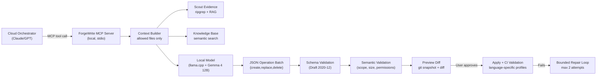

# ForgeWrite MCP v0.1.0-rc1

**Local-first MCP coding service with hard safety rails.**

ForgeWrite delegates narrow, well-scoped file edits to a local LLM (Gemma 4 12B via llama.cpp) while keeping the cloud orchestrator in control. It fails closed — every operation is previewed, hash-bound, and TOCTOU-guarded before it touches your working tree.

**358 tests. 22 MCP tools. 16 CLI commands. Rust + Python. RAG + Scout + Knowledge Base + TUI.**

---

## Quick Start

```bash
# 1. Install
git clone https://github.com/you/forgewrite_mcp.git
cd forgewrite_mcp
uv sync

# 2. Scaffold your project
uv run forgerwrite init --language rust   # or --language python

# 3. Edit .forgerwrite/forgerwrite.toml with your model endpoint

# 4. Build the RAG search index
uv run forgerwrite build-index

# 5. Run the doctor check
uv run forgerwrite doctor

# 6. Start the MCP server
uv run forgerwrite-mcp
```

---

## How It Works



1. The **cloud orchestrator** plans a slice and sends it via MCP.
2. **Scout** discovers relevant evidence via ripgrep + RAG retrieval.
3. The **Knowledge Base** is searched for reusable patterns from past runs.
4. A **context packet** is built from only the allowed files + evidence.
5. The **local model** (Gemma 4 12B) generates a JSON operation batch (create, replace, delete, insert).
6. Operations are **schema-validated** (Draft 2020-12), then **semantically checked** (scope, size, permissions).
7. A **git snapshot** is created and operations are applied to generate a preview diff.
8. You **review and approve** the diff (hash-bound, TOCTOU-guarded).
9. On approval, operations are **applied atomically** and CI validation runs.
10. If validation fails, a **bounded repair loop** re-invokes the model (max 2 attempts).
11. Successful runs can be **promoted to the Knowledge Base** for future reuse.
12. All artifacts are written to `.forgerwrite/runs/<run_id>/` — JSON, diff, audit trail, Markdown summary.

---

## Features

### Core Pipeline
- **14-state SliceCoordinator**: validate → scout → context → generate → schema → semantic → preview → approve → apply → validate → repair
- **Schema repair loop**: retries on malformed LLM JSON with feedback (up to 2 attempts)
- **Git snapshot + restore**: every operation is reversible
- **Hash-bound terminal approval**: SHA256 of preview diff is locked on approval — tamper detection

### Scout — Evidence Discovery
- **ripgrep + RAG** hybrid search across the codebase
- **Model-assisted query planning** (optional, requires LLM server) with deterministic fallback
- Bounded, path-policy-enforced grep (`fw_scout_grep`)
- Evidence deduplication, sorting, and capping

### Saved Work Knowledge Base
- **Semantic search** via TurboQuantIndex (gte-modernbert-base, 768-dim, 4-bit)
- **Run promotion**: extract reusable patterns from successful slices
- **Usage tracking**: record helped / did_not_help outcomes for continuous improvement
- **1,235 indexed documents**: Rust KB, Python KB, rust-by-example, rust-cookbook, Pydantic v2 docs, httpx docs

### Language Support
- **Rust**: cargo fmt, check, test, clippy validation profiles
- **Python**: ruff, pytest, mypy validation profiles
- Pluggable `LanguageAdapter` protocol for adding new languages

### RAG (Retrieval-Augmented Generation)
- **TurboQuantIndex** 4-bit compressed vector search
- **Semantic enrichment** of model prompts with relevant KB documents
- CPU-based embedding (gte-modernbert-base)

### Integrations
- **MEX adapter**: read-only access to `.mex/` project memory (fail-soft)
- **Graphify adapter**: codebase graph analysis (fail-soft)
- **Headroom adapter**: future orchestrator integration (placeholder)

### TUI Dashboard
- Real-time terminal dashboard via Textual
- Token usage by model and purpose
- Recent run history
- Knowledge Base status
- System health monitoring

---

## Architecture

```
forgerwrite_mcp/
├── artifacts.py          Run ID generation + centralized artifact I/O
├── approval.py           Hash-bound, TOCTOU-safe terminal approval + audit
├── audit.py              JSONL audit event log per run
├── audit_analyzer.py     Audit log analysis for Markdown/JSON reports
├── cli.py                Typer CLI — 16 commands, --json flag
├── config.py             Pydantic config models (8 sections: project, local_model,
│                         limits, validation, permissions, hygiene, repair, rag)
├── context.py            Context packet builder (per-file + total limits, SHA256)
├── coordinator.py        SliceCoordinator — 14-state pipeline, zero stubs
├── dead_letter.py        Centralized dead letter writer
├── doctor.py             Shared doctor checks (config, git, llama.cpp, RAG)
├── errors.py             PublicError, ErrorEnvelope, 10 error codes
├── llama_client.py       HTTP client for llama.cpp (retry + circuit breaker)
├── local_model.py        LocalModelBackend Protocol + FakeLocalModelBackend
├── model_state.py        Model state persistence for dashboards
├── paths.py              safe_resolve_path (DRY path safety)
├── repair.py             RepairCoordinator — bounded budget, feedback prompt
├── server.py             FastMCP server — 22 MCP tools, stdout→stderr
├── summary.py            Markdown run summary generator
├── token_tracker.py      Token usage tracker (by-model, by-purpose breakdowns)
├── tui.py                Textual TUI dashboard
├── contracts/            JSON Schema loading + Draft 2020-12 validation
├── forge/                Git snapshot/diff/restore utilities
├── integrations/         Fail-soft adapters: MEX, Graphify, Headroom
├── knowledge/            Saved Work Knowledge Base (store, indexer, promotion)
├── languages/            LanguageAdapter protocol + Rust/Python implementations
├── operations/           6 file operation handlers (create, replace, delete, insert)
├── rag/                  RAG subsystem (indexer, retriever, enricher, preprocessor)
├── scout/                Scout evidence discovery (coordinator, safe_grep)
└── validation/           CI validation runner + semantic rules
```

---

## MCP Tools (22)

| Tool | Description |
|------|-------------|
| `fw_ping` | Health check |
| `fw_model_health` | llama.cpp server health + loaded models |
| `fw_validate_handoff` | Validate handoff contract against JSON Schema |
| `fw_validate_slice` | Validate slice contract against JSON Schema |
| `fw_build_context_packet` | Build bounded context from allowed files |
| `fw_generate_operations_local` | Invoke local model with optional RAG enrichment |
| `fw_validate_operations` | Schema + semantic validation of operation batch |
| `fw_preview_operations` | Generate preview diff via git snapshot + approval record |
| `fw_apply_approved_operations` | Apply approved operations (TOCTOU-guarded, optional auto-validate) |
| `fw_run_validation_profile` | Run language-specific CI validation (rust/python profiles) |
| `fw_get_run_summary` | Get Markdown summary of a run |
| `fw_turbovec_health` | RAG index health check |
| `fw_turbovec_index` | Build/rebuild TurboVec retrieval index (fire-and-forget) |
| `fw_scout` | Evidence discovery via ripgrep + RAG (optional model planner) |
| `fw_scout_grep` | Bounded grep through path policy |
| `fw_knowledge_search` | Semantic search of the Saved Work KB |
| `fw_knowledge_save_entry` | Save a knowledge entry (with schema validation) |
| `fw_knowledge_get_entry` | Get entry by ID |
| `fw_knowledge_promote_from_run` | Promote a successful run to a knowledge entry |
| `fw_knowledge_record_usage` | Record helped/did_not_help outcome |
| `fw_knowledge_deprecate_entry` | Mark entry as deprecated |
| `fw_token_stats` | Token usage by model and purpose, with cloud cost comparison |

## CLI Commands (16)

| Command | Description |
|---------|-------------|
| `forgerwrite init` | Scaffold `.forgerwrite/` directory and config |
| `forgerwrite doctor` | Check environment: config, git, llama.cpp, RAG |
| `forgerwrite approve <run_id>` | Review diff and approve (interactive, hash-bound) |
| `forgerwrite show-diff <run_id>` | Pretty-print preview diff |
| `forgerwrite inspect <run_id>` | Print full Markdown run summary |
| `forgerwrite restore <run_id>` | Restore git snapshot for a run |
| `forgerwrite abort <run_id>` | Abort: restore snapshot + write dead letter |
| `forgerwrite gc` | Clean expired run directories + orphan snapshot refs |
| `forgerwrite runs list` | List all runs with status and timestamps |
| `forgerwrite project status` | Show project config summary |
| `forgerwrite build-index` | Rebuild RAG search index from KB files |
| `forgerwrite scout <question>` | Run Scout evidence discovery (with `--use-model-planner`) |
| `forgerwrite token-stats` | Show token usage and estimated cloud cost savings |
| `forgerwrite tui` | Launch Textual TUI dashboard |
| `forgerwrite audit-report` | Analyze audit logs and produce a report |
| `forgerwrite model-status` | Check llama.cpp model server health |

All commands support `--json` for machine-readable output.

---

## Configuration

See [docs/configuration.md](docs/configuration.md) for the full reference.

```toml
# .forgerwrite/forgerwrite.toml

[project]
name = "my-project"
language = "rust"
repo_root = "."

[local_model]
provider = "llama_cpp"
endpoint = "http://127.0.0.1:8080/v1"
model = "gemma-4-12b-it"
temperature = 0.20
top_p = 0.90
top_k = 20
max_tokens = 4096
json_retries = 2
request_timeout_seconds = 180

[limits]
context_file_max_bytes = 200000
context_total_max_bytes = 8000000
validation_output_max_chars = 16000
operation_batch_max_operations = 32
operation_content_max_bytes = 200000
artifact_retention_days = 90

[validation]
default_timeout_seconds = 300
graceful_kill_timeout_seconds = 5

[validation.commands]
# Populated from language adapter at init time

[validation.profiles]
# Populated from language adapter at init time

[permissions]
require_clean_worktree = true
allow_unknown_commands = false
require_approval_for_delete = true
require_approval_for_full_file_replace = true

[hygiene]
generated_globs = ["target/**"]
vendor_globs = ["vendor/**"]

[repair]
max_attempts = 2
scope_must_match_original_slice = true

[rag]
enabled = false
index_path = "data/rag/index.tqi"
k_documents = 5
embedding_model_name = "Alibaba-NLP/gte-modernbert-base"
max_rag_tokens = 2048
```

---

## Operations

ForgeWrite supports six operation types via structured JSON:

| Operation | Description |
|-----------|-------------|
| `create_file` | Create a new file with content (200KB cap) |
| `replace_file` | Replace entire file content |
| `replace_line_range` | Replace lines [start, end] in a file |
| `insert_after_line` | Insert content after a specific line |
| `insert_before_line` | Insert content before a specific line |
| `delete_file` | Remove a file |

See [docs/operations.md](docs/operations.md) for the full JSON schema reference.

---

## Local Model Setup

ForgeWrite requires a running llama.cpp server. The recommended model is **Gemma 4 12B** (Q4 or better, ~8GB VRAM), but any instruction-tuned model with JSON generation ability works.

Quick start with the included launcher:

```bash
bash scripts/launch-gemma4.sh     # Gemma 4 12B
bash scripts/launch-omnicoder.sh   # OmniCoder 9B (alternative)
```

See [docs/llama-cpp-setup.md](docs/llama-cpp-setup.md) for detailed instructions.

Required hardware:
- **GPU**: 12 GB VRAM recommended (Gemma 4 Q4 ~8GB)
- **RAM**: 32 GB recommended (embedding model runs on CPU)

---

## Safety Guarantees

- **Path safety**: All paths go through `safe_resolve_path()` — rejects `/`, `..`, null bytes, symlink escapes.
- **Worktree guard**: Operations refuse to run if `git status --porcelain` is dirty.
- **TOCTOU**: Worktree cleanliness is re-checked before apply, even after approval.
- **Hash-bound approval**: Approval record includes SHA256 of the preview diff — diff cannot be modified after approval.
- **File locking**: Approval records use `fcntl.LOCK_EX` for concurrent safety.
- **Public errors**: All errors map to public codes — no exception class names or raw messages leak.
- **No shell**: Validation commands run with `shell=False`.
- **Signal handling**: Long-running validation gets SIGTERM, then SIGKILL after a configurable grace period.
- **Dead letter**: Unrecoverable failures write a `dead_letter.json` with timestamp and context.
- **Audit trail**: Every approve, apply, restore, and abort writes a JSONL audit event.

---

## Development

```bash
uv sync --group dev
uv run pytest -q           # 358 tests
uv run ruff check .        # Lint
uv run mypy forgerwrite_mcp/  # Type check
```

### All Gates

```bash
uv run ruff check forgerwrite_mcp/ tests/ && \
  uv run mypy forgerwrite_mcp/ && \
  uv run pytest tests/ -q
```

---

## Documentation

- **[CLI Reference](docs/cli-reference.md)** — all 16 CLI commands with syntax and examples
- **[Configuration](docs/configuration.md)** — full config reference (7 sections)
- **[Operations](docs/operations.md)** — JSON schema for file operations
- **[Knowledge Base](docs/knowledge-base.md)** — using the Saved Work KB
- **[Language Adapters](docs/adapters.md)** — Rust, Python, and adding new languages
- **[Troubleshooting](docs/troubleshooting.md)** — common issues and fixes
- **[llama.cpp Setup](docs/llama-cpp-setup.md)** — model server setup guide
- **[Release Notes](docs/release-notes-v0.1.0.md)** — v0.1.0-rc1 release notes
- **[Implementation Plan](docs/implementation-plan.md)** — full development roadmap
- **[Dogfood Plan](docs/dogfood-plan.md)** — using ForgeWrite to build ForgeWrite
- **[Project State](docs/project-state.md)** — current project status and module inventory
- **[Phase 7 Hardening](docs/phase-7-hardening.md)** — dogfood hardening plan
- **[CHANGELOG](CHANGELOG.md)** — release history

---

## License

MIT — see [LICENSE](LICENSE) for full text.
