# ForgerWrite MCP

**Local-first MCP coding service with hard safety rails.**

ForgerWrite delegates narrow, well-scoped file edits to a local coding model (llama.cpp + OmniCoder 9B) while keeping the cloud orchestrator in control. It fails closed — every operation is previewed, hash-bound, and TOCTOU-guarded before it touches your working tree. Includes RAG (Retrieval-Augmented Generation) with semantic search over a curated Rust knowledge base to improve model output quality.

---

## Quick Start

```bash
# 1. Install
git clone https://github.com/you/forgewrite_mcp.git
cd forgewrite_mcp
uv sync

# 2. Scaffold your project
uv run forgerwrite init

# 3. Edit .forgerwrite/forgerwrite.toml with your model endpoint (OmniCoder 9B default, see docs/llama-cpp-setup.md for Gemma 4 or other models)

# 4. Build the RAG search index (optional, improves model quality)
uv run forgerwrite build-index

# 5. Run the doctor check
uv run forgerwrite doctor

# 6. Start the MCP server
uv run forgerwrite-mcp
```

---

## How It Works

```mermaid
flowchart LR
    Cloud["Cloud Orchestrator\n(Claude/GPT)"] -->|MCP tool call| Server["ForgerWrite MCP Server\n(local, stdio)"]
    Server --> Context["Context Builder\nallowed files only"]
    Context --> Model["Local Model\n(llama.cpp + OmniCoder)"]
    Model --> Ops["JSON Operation Batch\n{create,replace,delete}"]
    Ops --> Schema["Schema Validation\n(Draft 2020-12)"]
    Schema --> Semantic["Semantic Validation\n(scope, size, permissions)"]
    Semantic --> Preview["Preview Diff\n(git snapshot + diff)"]
    Preview -->|User approves| Apply["Apply + CI Validation\n(cargo fmt/check/test/clippy)"]
    Apply -->|Fails| Repair["Bounded Repair Loop\n(max 2 attempts)"]
```



1. The **cloud orchestrator** plans a slice and sends it via MCP.
2. ForgerWrite builds a **context packet** from only the allowed files.
3. The **local model** generates a JSON operation batch (create, replace, delete, insert).
4. Operations are **schema-validated**, then **semantically checked** (scope, size, forbidden targets).
5. A **git snapshot** is created and operations are applied to generate a preview diff.
6. **You review and approve** the diff in the terminal (or via `--dry-run`).
7. On approval, operations are **applied atomically** and CI validation runs.
8. If validation fails, a **bounded repair loop** re-invokes the model (max 2 attempts).
9. All artifacts are written to `.forgerwrite/runs/<run_id>/` — JSON, diff, audit trail, Markdown summary.

---

## Architecture

```
forgerwrite_mcp/
├── artifacts.py          Run ID generation + artifact I/O
├── approval.py           Hash-bound, TOCTOU-safe terminal approval
├── audit.py              JSONL audit event log per run
├── cli.py                Typer CLI — 12 commands
├── config.py             Pydantic config models (7 sections)
├── context.py            Context packet builder (per-file + total limits)
├── coordinator.py        SliceCoordinator — 14-state pipeline
├── dead_letter.py        Centralized dead letter writer
├── errors.py             PublicError, ErrorEnvelope, 10 error codes
├── llama_client.py       HTTP client for llama.cpp (retry + circuit breaker)
├── local_model.py        LocalModelBackend Protocol
├── paths.py              safe_resolve_path (DRY path safety)
├── repair.py             RepairCoordinator — bounded budget
├── server.py             FastMCP server — 10 thin tools
├── summary.py            Markdown run summary generator
├── contracts/            JSON Schema loading + validation
├── forge/                Git snapshot + diff utilities
├── operations/           6 file operation handlers
└── validation/           CI validation runner + semantic rules
```

---

## MCP Tools

| Tool | Description |
|------|-------------|
| `fw_ping` | Health check |
| `fw_validate_handoff` | Validate handoff contract against schema |
| `fw_validate_slice` | Validate slice contract against schema |
| `fw_build_context_packet` | Build bounded context from allowed files |
| `fw_generate_operations_local` | Invoke local model to generate operations |
| `fw_validate_operations` | Schema + semantic validation of operation batch |
| `fw_preview_operations` | Generate preview diff via git snapshot |
| `fw_apply_approved_operations` | Apply approved operations (TOCTOU-guarded) |
| `fw_run_validation_profile` | Run CI validation commands |
| `fw_get_run_summary` | Get Markdown summary of a run |

---

## CLI Commands

| Command | Description |
|---------|-------------|
| `forgerwrite init` | Scaffold `.forgerwrite/` directory and config |
| `forgerwrite doctor` | Check environment: config, git, llama.cpp |
| `forgerwrite approve <run_id>` | Review diff and approve (interactive) |
| `forgerwrite approve --dry-run <run_id>` | View diff without approving |
| `forgerwrite show-diff <run_id>` | Pretty-print preview diff |
| `forgerwrite inspect <run_id>` | Print full Markdown run summary |
| `forgerwrite restore <run_id>` | Restore git snapshot |
| `forgerwrite abort <run_id>` | Abort: restore + write dead letter |
| `forgerwrite gc` | Clean expired run directories |
| `forgerwrite runs list` | List all runs |
| `forgerwrite project status` | Show project config summary |

All commands support `--json` for machine-readable output.

---

## Configuration

See [docs/configuration.md](docs/configuration.md) for the full reference.

```toml
# .forgerwrite/forgerwrite.toml

[project]
name = "my-project"
language = "rust"

[local_model]
provider = "llama_cpp"
endpoint = "http://127.0.0.1:8080/v1"
model = "omnicoder-9b"

[limits]
context_file_max_bytes = 200000
operation_batch_max_operations = 32

[validation.commands]
fmt = "cargo fmt -- --check"
check = "cargo check"
test = "cargo test"
clippy = "cargo clippy --all-targets --all-features -- -D warnings"

[repair]
max_attempts = 2
```

---

## Operations

ForgerWrite supports six operation types via structured JSON:

| Operation | Description |
|-----------|-------------|
| `create_file` | Create a new file with content |
| `replace_file` | Replace entire file content |
| `replace_line_range` | Replace lines [start, end] in a file |
| `insert_after_line` | Insert content after a specific line |
| `insert_before_line` | Insert content before a specific line |
| `delete_file` | Remove a file |

See [docs/operations.md](docs/operations.md) for the full JSON schema reference.

---

## Local Model Setup

ForgerWrite requires a running llama.cpp server with OmniCoder 9B (Q8 or better).

See [docs/llama-cpp-setup.md](docs/llama-cpp-setup.md) for step-by-step instructions.

---

## Safety Guarantees

- **Path safety**: All paths go through `safe_resolve_path()` — rejects `/`, `..`, null bytes, symlink escapes.
- **Worktree guard**: Operations refuse to run if `git status --porcelain` is dirty.
- **TOCTOU**: Worktree cleanliness is re-checked before apply, even after approval.
- **Hash-bound approval**: Approval record includes SHA256 of the preview diff — diff cannot be modified after approval.
- **File locking**: Approval records use `fcntl.LOCK_EX` for concurrent safety.
- **Public errors**: All errors map to public codes — no exception class names or raw messages leak.
- **No shell**: Validation commands run with `shell=False`.
- **Signal handling**: Long-running validation gets SIGTERM, then SIGKILL after a configurable grace period.
- **Dead letter**: Unrecoverable failures write a `dead_letter.json` with timestamp and context.
- **Audit trail**: Every approve, apply, restore, and abort writes a JSONL audit event.

---

## Development

```bash
uv sync --group dev
uv run pytest -q           # 180+ tests
uv run ruff check .        # Lint
uv run mypy forgerwrite_mcp/  # Type check
```

---

## License

MIT
